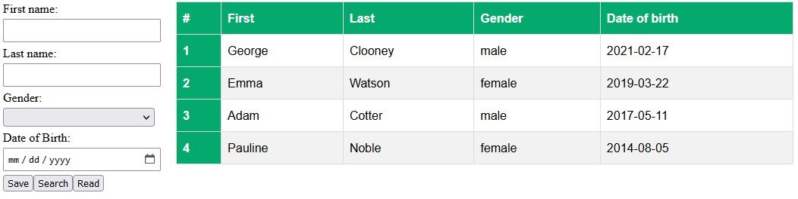

# REST-service-and-Angular-client

In UserService folder are REST service based on Spring-boot Framework. Service has input object, output object list and search request from some fields. Users are saved in H2 database.
Object contains: id, first name, last name, gender and date of birth.

In UserManager folder are Angular client manager which contains input form with search parameters and result table.

